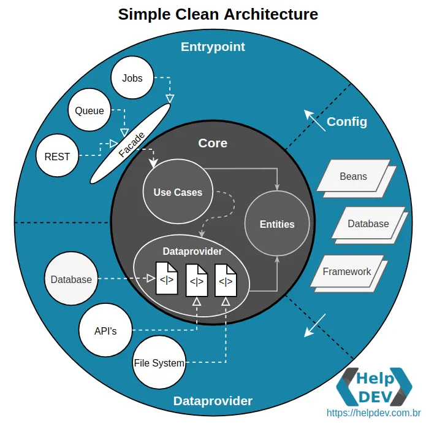

# Getting Started

# This microservice uses Clean Architecture:
- [What is Clean Architecture?](https://medium.com/luizalabs/descomplicando-a-clean-architecture-cf4dfc4a1ac6)

# How this microservice is divided?



#### Every UseCase uses a Gateway Interface which is implemented by Dataprovider. 

#### To view the endpoints exposed by this service access the url
``` 
http://localhost:8080/swagger-ui/index.html
```

#### 1. Before start the application, run the docker command below to start mongodb
```
docker compose -f docker-compose.yaml up -d
```