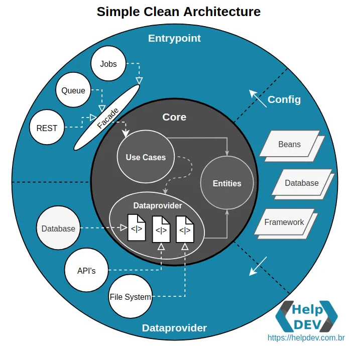

# Getting Started

This microservice uses Clean Architecture:
- [What is Clean Architecture?](https://medium.com/luizalabs/descomplicando-a-clean-architecture-cf4dfc4a1ac6)

To provide the validation of proposed architecture this template uses [ArchUnit](https://www.archunit.org/)
- The tests of ArchUnit is inside com.picpay.archunit test classes; please, change it if you need, if you dont have a worker layer or api you can simple remove these layers from archunit test
- The tests also garantee a good codestyle, removal of unused classes and many others testing so this project can evolve keeping the original architecture

How this microservice is divided?

Every UseCase uses a Gateway Interface which is implemented by Dataprovider. 